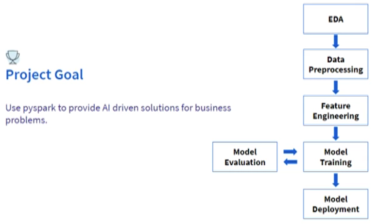

## Scenario

A Telecommunications company has approached our team of data scientists with a problem of customer churn in their business. The business owner has provided us with some data to work on. Our task is to provide recommendations to the company to effectively solve the problem of customer churn. To achieve this, we will be using PySpark to develop a machine learning model based on a decision tree algorithm that will identify the factors that contribute to customer churn. We will then provide actionable insights to the company to reduce customer churn and increase customer retention.

